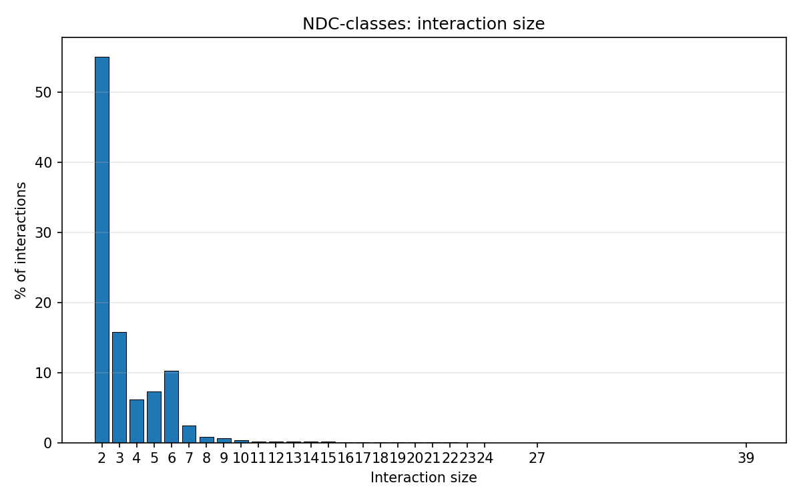
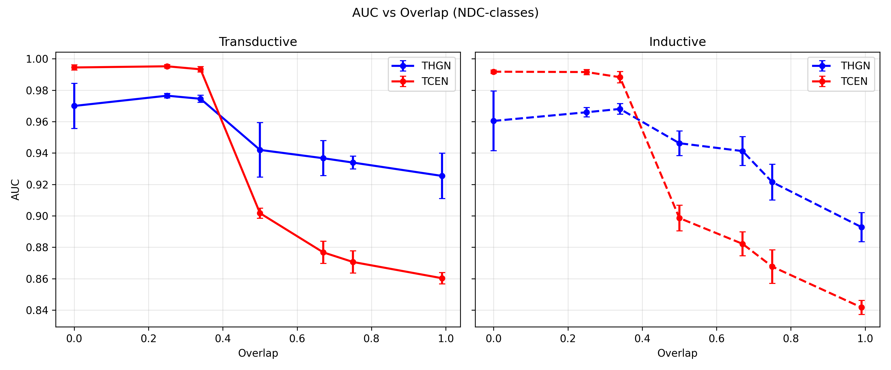
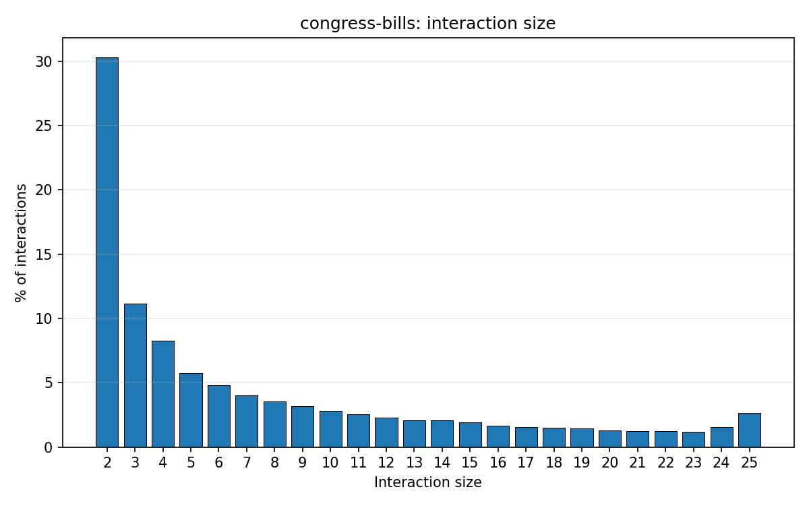
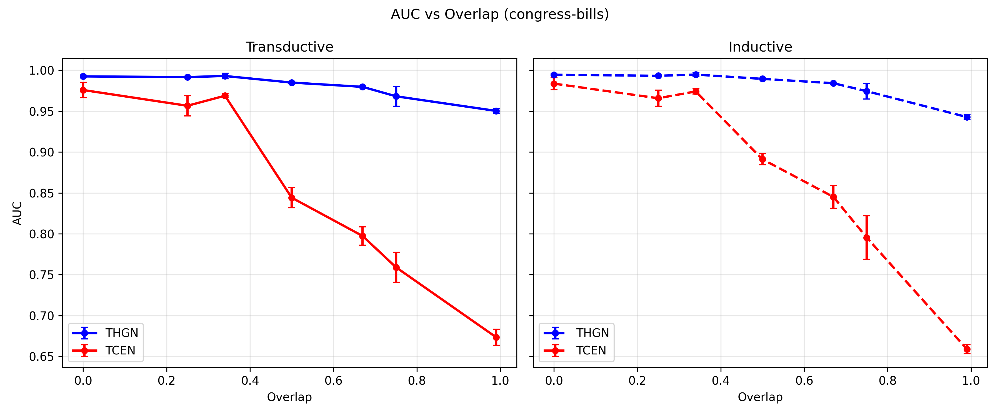
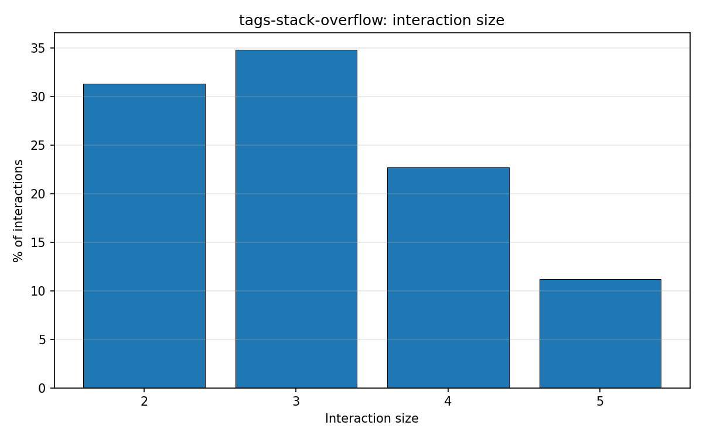
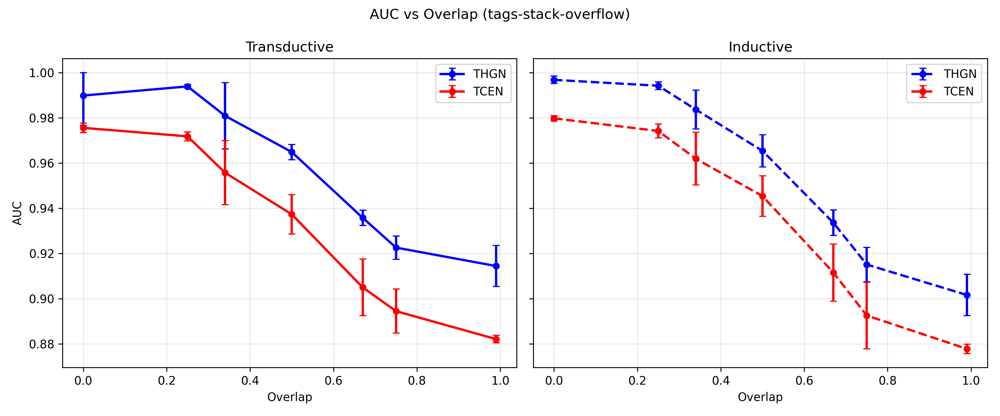

# Temporal Higher-Order Networks: THGN and a Clique-Expansion TGN Baseline

## Table of contents

- [1. Overview](#1-overview)
- [2. THGN: Logical Generalization of TGN](#2-thgn-logical-generalization-of-tgn)
- [3. TCEN: Clique Expansion as the Pairwise Baseline](#3-tcen-clique-expansion-as-the-pairwise-baseline)
- [4. Negative Sampling and Evaluation Alignment](#4-negative-sampling-and-evaluation-alignment)
- [5. Experimental Setup](#5-experimental-setup)
- [6. Results](#6-results)
- [7. Summary](#7-summary)
- [8. Usage](#8-usage)
- [9. References](#8-references)

## 1. Overview

### Temporal interaction data

Many real-world systems evolve through streams of **timestamped interactions** between entities: users communicate in social networks, accounts exchange funds in financial systems, researchers co-author papers, or tags co-occur on online platforms. Such data are naturally modeled as a **temporal graph** (or temporal network), where nodes represent entities and interactions occur at specific times.

In many applications, interactions are not only **pairwise**. Instead, several entities may participate jointly in a single event at time \(t\). These higher-order interactions can be written as set-valued events \((S,t)\), where \(S\) is a set of participating nodes.

This repository studies **temporal link prediction** in that setting: given a candidate interaction at time \(t\), predict whether that interaction occurs based only on past history.

---

### Pairwise temporal models: TGN

For standard dyadic streams of events \((u,v,t)\), **Temporal Graph Networks (TGN)** provide a widely used self-supervised framework for temporal link prediction. TGN maintains a memory per node, updates it from past interactions, retrieves temporal neighbors before the query time, and scores candidate interactions against sampled negatives.

A common way to apply TGN to higher-order data is to first perform a **clique expansion**: every group interaction is decomposed into all unordered node pairs, producing a temporal interaction stream that a pairwise model can ingest.

---

### THGN and TCEN

This repository introduces **THGN (Temporal Hypergraph Networks)**, a higher-order generalization of the Temporal Graph Network (TGN) framework, and compares it against a pairwise baseline derived from the same data.

- **THGN (Temporal Hypergraph Networks)** — Temporal context aggregation, memory updates, negative sampling, and decoding are generalized from pairwise interactions to higher-order interactions, allowing the model to score entire groups directly.

- **TCEN (Temporal Clique Expansion Networks)** — applies a standard TGN to the clique expansion of the same higher-order interactions. Each interaction is expanded into all unordered node pairs, producing a purely pairwise temporal stream.

Although TCEN trains on pairwise interactions, evaluation is performed at the original interaction level so both models solve the same prediction task under aligned preprocessing and negative construction.

---

### Scientific question

The goal is not only to evaluate whether THGN performs well in isolation, but to study whether explicitly modeling **group structure** behaves differently from modeling only the **pairwise projection** of the same phenomena.

To isolate that question, preprocessing, temporal splits, inductive masks, negative construction, and evaluation metrics are aligned across both pipelines.

A central experimental parameter is the **overlap ratio** between positive and negative interactions. Low overlap produces easy negatives, while high overlap produces near-positive negatives that require reasoning about higher-order group structure.

**Main observation.** As the overlap ratio increases, both models exhibit a clear and consistent deterioration in performance, as expected from the increasing difficulty of distinguishing negatives that become structurally closer to positive interactions.

At low overlap ratios (easy negatives), THGN and TCEN are often competitive, with relative performance depending on the dataset. However, as overlap increases and negatives become increasingly similar to positives, THGN consistently outperforms TCEN, suggesting an advantage to explicitly modeling higher-order group structure rather than relying on pairwise projections.


---

## 2. THGN: Logical Generalization of TGN

THGN preserves the high-level TGN philosophy—evolving node state, temporal neighborhoods before a query time, etc.—but the **ontology of an event** changes from dyadic to higher-order. The modifications below are the substantive generalization steps; lower-level implementation follows from them.

### 2.1 Event space: from pairs to sets

TGN assumes events of the form \(u, v, t\): an ordered or unordered pair of nodes (edge) at time t. THGN assumes events of the form \(S, t\) where S is a finite set of nodes (hyperedge) with **variable cardinality**. The prediction target is no longer “this edge occurs” but “this **set** co-occurs as one interaction at t”. That change forces **permutation invariance** over members of S in the scoring rule, and it changes what counts as meaningful temporal context (co-participation in past **groups**, not only past pairwise touches). This distinction becomes critical when predicting whether a node fits into an existing group: pairwise compatibility with each member does not guarantee joint compatibility with the set.

### 2.2 Message semantics: from dyadic conditioning to set-to-node conditioning

In TGN, memory updates are driven by pairwise interactions: each node’s message is conditioned on the **other** node and the interaction context. In THGN, each node \(i \in S\) receives an update signal that must reflect the **rest of the nodes** \(S \setminus \{i\}\)—a set-valued counterpart, not a single “other node”. A fixed-dimensional summary (aggregation over co-participants) is required so that message dimension does not grow with |S|. 

### 2.3 Temporal context: interaction-level neighborhoods

TGN gathers context from past **pairwise** contacts. THGN instead gathers context from past **group** contacts. The outline is: (i) identify several past interactions that involved the query node and occurred **before** the query time (same non-leakage idea as TGN); (ii) from **each** such interaction, take the **other** participants as contextual nodes—so locality is defined by “who was in the same interaction,” not only “who touched the query node in isolation.” Large interactions are subsampled so context stays bounded. The temporal attention module then aggregates these slots like TGN aggregates neighbor embeddings, with each slot still carrying the timestamp and interaction identity of its parent event. Deeper layers repeat the same pattern on neighbors-of-neighbors, so multi-hop structure propagates through **sequences of past interactions**, not only through a flattened pairwise representation.

### 2.4 Prediction semantics: from pair scoring to set scoring

TGN’s decoder scores a pair of node embeddings. THGN must assign a scalar to a **set** of embeddings of arbitrary size. The decoder must be **permutation-invariant** and **cardinality-robust** (via pooling). The learned question becomes whether the joint presence of the members of S at time t is consistent with the model’s temporal state, rather than whether a single ordered pair \(u,v\) is present.

### 2.5 Self-supervised signal: negatives in set space

Link prediction with TGN typically contrasts observed edges against sampled **non-edges** at the same time. Hyperedge prediction requires contrasts in **set space**: negatives are node sets of the **same size** as the positive interaction. For **validation and test**, how hard those negatives are is controlled by an **overlap ratio** between the negative set and the positive (higher overlap yields harder, near-positive negatives). Details of construction and alignment with the pairwise baseline are in **Section 4**.

---

## 3. TCEN: Clique Expansion as the Pairwise Baseline

**TCEN** denotes the use of a standard **Temporal Graph Network** (TGN) architecture on data derived from the same higher-order source as THGN. The reduction is explicit:

**Clique expansion.** For each observed hyperedge S at timestamp t (with associated feature vector attached to that hyperedge in preprocessing), form one dyadic training or evaluation instance for every **unordered pair** \(\{u,v\} \subseteq S\) with \(u \neq v\). All such pairs inherit the **same** timestamp t and the **same** parent hyperedge features. Thus, the temporal edge stream seen by TCEN is not an independently collected pairwise dataset, but a projection of higher-order events.

**Evaluation.** Training and inference remain **pairwise**: the network outputs one probability per expanded edge. For validation and test, results are reported at the **original hyperedge** (interaction) level so they align with THGN: all clique pairs that share the same interaction ID are grouped, and the score for that interaction is the **average** of the predicted probabilities over those positive pairs (and separately the **average** over the corresponding negative pairs from the aligned negative clique). AUC and AP are computed from these per-interaction aggregates, not from treating every pair as an independent label. Importantly, TCEN is not trained to predict hyperedges directly, but rather pairwise edges that are later aggregated at evaluation time. 

**Why this baseline.** Clique expansion is the natural pairwise **projection** of higher-order data: it is what many pipelines implicitly assume when they “flatten” group interactions to edges. Comparing THGN to TCEN isolates whether retaining **one event per group** (THGN) behaves differently from **many correlated pair events per group** (TCEN), under shared temporal splits and inductive masks. 

---

## 4. Negative Sampling and Evaluation Alignment

For **validation and test**, negatives are **fixed at preprocessing** and stored in the split CSVs so that runs are reproducible and comparable across models.

For THGN, each validation/test hyperedge carries a **negative hyperedge** of the same cardinality as the positive set, built from a controlled **overlap** with the positive (a fraction of nodes may be retained from the positive, the rest replaced from the global node pool). Overlap parametrizes **hardness**: high overlap yields negatives that are close to positives in set space. The overlap ratio is the central parameter controlling task difficulty in the experiments. This allows us to systematically probe regimes ranging from trivial (fully disjoint negatives) to near-positive (overlap on all-but-one nodes) cases. Due to the relatively small size of most hyperedges in the datasets, the overlap ratio effectively induces a small number of discrete regimes (e.g., zero overlap vs. one-node replacement), leading to sharp transitions in model performance rather than smooth changes. More on this in **Section 5**.

For TCEN, the same negative hyperedge is **projected to pairs** via the same clique rule, and the negative pairs are aligned with the positive pairs. Thus pairwise negatives are **consistent** with a single sampled negative hyperedge, not independent random edges unrelated to the THGN negative construction.

TCEN training follows the TGN link-prediction recipe: keep the **positive source** and pair it with a **random alternative destination** (not a fully random edge in both endpoints). **THGN training** instead samples negative **hyperedges** on the fly with controlled overlap; what matters for fair comparison is still the **same frozen val/test negatives** for both models.

---

## 5. Experimental Setup

The following subsections specify the benchmark design: datasets, prediction tasks, temporal and inductive splits, negative construction, model families, metrics, and how experiments are organized. Preprocessing is shared so that both models see the same events and evaluation instances.

### 5.1 Datasets

We use **three** temporal hypergraph datasets. Each record lists a set of participants S and a timestamp t. **Singleton events (|S|=1) are removed** before modeling so that every retained interaction induces at least one unordered pair, which is required for meaningful clique expansion in the pairwise baseline. The table summarizes the **non-singleton** subgraph used in all experiments.

| Dataset | Domain (informal) | Non-singleton interactions | Unique nodes |
|--------|-------------------|----------------------------|---------------|
| **NDC-classes** | Drug–drug co-listing (NDC drug classes) | 46,285 | 1,149 |
| **congress-bills** | Legislative co-sponsorship (bills) | 105,929 | 1,718 |
| **tags-stack-overflow** | Co-tagging on Stack Overflow posts | 438,720 | 20,063 |

Finer counts, including histograms of interaction size on the raw tables, are emitted next to the source data during preprocessing.

### 5.2 Task definition

**THGN.** Self-supervised **temporal hyperedge prediction**: for each timestamped group interaction S, the model scores the observed hyperedge against a **same-cardinality** negative hyperedge at the same time, optimized with a binary cross-entropy objective.

**TCEN.** The same streams are represented as a **temporal pairwise** graph by clique expansion (see Section 3). Training follows the usual **per-edge** link-prediction objective with random destination negatives. At validation and test, we still ask a **group-level** question: pair scores are pooled to one positive and one negative value per original interaction (see Section 5.6).

### 5.3 Train / validation / test splits and inductive evaluation

**Temporal split.** Interactions are partitioned by **timestamp quantiles** into training, validation, and test: by default, roughly **70% / 15% / 15%** of the temporal mass fall into each block (cutoffs at the 0.70 and 0.85 quantiles of event times). The same chronological assignment and interaction identifiers are used for THGN and for the expanded pairwise stream, so **splits are aligned** across models.

**Transductive vs. inductive.** After the temporal split, we consider every node that appears in **at least one interaction in the validation or test period**. From that pool we draw a **random subset** whose size targets **10%** of all distinct nodes in the dataset. Those nodes are labeled **new**. For **inductive** training, we **remove every training-time interaction that contains a new node**, so optimization never sees those entities on the training slice. **Transductive** training keeps those rows. Validation and test interactions are labeled according to whether they involve a new node, which defines **transductive** versus **inductive** metrics. THGN and TCEN share the **same** new-node set and the **same** notion of which interactions count as new-node cases, because both are produced from one preprocessing run—expanding hyperedges to pairs does not change who is “new”.

### 5.4 Negative sampling protocol

**Overlap.** For a positive hyperedge of size k, a negative hyperedge keeps \lfloor \rho k \rfloor nodes sampled uniformly from the positive set (without replacement) and replaces the remainder with nodes drawn uniformly from the set of nodes not in the positive hyperedge. The scalar \rho \in [0,1] is the **overlap ratio** between negative and positive sets. For small k, only a few overlap levels are realizable, so performance can change abruptly rather than smoothly as \rho varies. Seven ratios are used in the experiment: 0, 0.25, 0.34, 0.5, 0.67, 0.75 and 0.99.

**Evaluation.** For validation and test, one negative hyperedge per interaction is sampled **once** during preprocessing, with overlap and randomness fixed, and **reused for every run and for both models**. The pairwise baseline uses the **clique expansion of that same negative set**, so negatives are not independent random edges unrelated to the hypergraph construction.

**Training.** THGN continues to draw **on-the-fly** negative hyperedges during optimization. The overlap used for training negatives is not tied to the evaluation overlap. TCEN at training time follows the **standard random-destination** recipe on expanded pairs. Thus training noise differs by design; comparability is enforced at **validation and test**.

### 5.5 Models and hyperparameters

Both systems follow the **Temporal Graph Network** architectural template unless ablated: temporal attention over past interactions, optional **node memory** with GRU-style updates, graph-attention-style embedding of neighbors, and optimization with Adam on mini-batches, with **early stopping** on validation average precision. Hidden widths, numbers of heads and layers, dropout, and training horizon are set to conventional values for this family of models. **Reported experiments enable memory.**

**Neighbor budget (n).** This parameter has slightly different semantics across models. In TCEN, it corresponds to the number of temporal edges retrieved. In THGN, it corresponds to the number of past interactions, from which multiple co-participating nodes are extracted. As a result, THGN may access a larger contextual set per query. We keep the parameter aligned at the interaction level for conceptual consistency, rather than strictly matching the number of nodes observed. We do not attempt to strictly equalize the total number of nodes observed per query, as the two models operate on different primitives (edges vs. interactions).

### 5.6 Evaluation metrics

**Both models** are scored with **area under the ROC curve (AUC)** and **average precision (AP)** at the **interaction level** on validation and test: one positive score and one negative score per group event.

- **THGN:** the score is the predicted probability of the hyperedge versus its fixed evaluation negative.
- **TCEN:** the model outputs one probability per expanded pair; we **average** positive-pair probabilities and, separately, negative-pair probabilities **within the same parent interaction**, then compute AUC and AP from those aggregates (not from treating each pair as an independent example). This ensures that both models are evaluated on the same prediction task.

**Stratification.** We report four headline quantities: **transductive** and **inductive** AUC and AP, using the inductive tagging from Section 5.3. Model selection uses **validation average precision** on the corresponding split.

### 5.7 Experimental protocol

**Overlap sweep.** A primary manipulation varies the evaluation overlap \rho by **rebuilding the preprocessed splits** with the corresponding overlap parameter for each setting, while keeping other choices fixed. Illustrative values in this repository include \rho \in \{0,\,0.25,\,0.34,\,0.5,\,0.67,\,0.75,\,0.99\} (see Section 6).

**Replication.** Results are summarized **per dataset**. We repeat training with **3 - 5 random seeds** (depending on dataset size) and report **mean and standard deviation** over seeds for each model.

**Pipeline.** Experiments proceed from shared preprocessing to separate training of THGN and TCEN on the emitted splits, then to test metrics and optional dumps of per-interaction scores for analysis. Exact file names, default constants, and script entry points are left to the repository; they implement the protocol above.

All preprocessing and split generation are deterministic given a random seed.

---

## 6. Results

Across all datasets, performance deteriorates as the overlap ratio increases for both THGN and TCEN. This behavior is expected: higher overlap produces harder negatives that are increasingly similar to the positive interaction, making the prediction task substantially more challenging. At low overlap ratios, the relative behavior of the two models is dataset-dependent. However, as overlap increases, a consistent pattern emerges: THGN becomes increasingly favorable relative to TCEN, suggesting that explicit modeling of higher-order group structure becomes more important when negatives cannot be separated through simple pairwise compatibility alone.

### NDC-classes

Interaction-size distribution (non-singleton hyperedges, % of interactions):



Test AUC vs. evaluation negative overlap \(\rho\) (transductive left, inductive right; mean ± std over seeds):



On **NDC-classes**, TCEN performs slightly better than THGN for overlap ratios below \(0.5\), but performance changes sharply once the overlap reaches \(0.5\) and above. This is consistent with the structure of the dataset: the majority of interactions are dyadic, where overlap ratios below \(0.5\) produce negatives in which **both nodes differ** from the positive edge, whereas ratios of \(0.5\) and above force the negative to share **one endpoint** with the positive. This creates a qualitatively harder prediction regime, explaining the sharp transition observed around \(\rho = 0.5\).

### congress-bills

Interaction-size distribution (non-singleton hyperedges, % of interactions):



Test AUC vs. evaluation negative overlap \(\rho\) (transductive left, inductive right; mean ± std over seeds):



On **congress-bills**, THGN already performs slightly better than TCEN even at lower overlap ratios, and the advantage widens substantially as overlap increases. The transition around \(\rho = 0.5\) is again clearly visible, with TCEN degrading much more rapidly than THGN.

This dataset contains substantially richer higher-order structure than NDC-classes: more than one third of interactions are of size \(8\) or larger, compared to roughly 3% in NDC-classes. In such large interactions, high-overlap negatives retain most of the original nodes. Under clique expansion, many negative pairs therefore correspond to pairwise relations that also appear in the positive interaction. As a result, the pairwise stream seen by TCEN becomes highly ambiguous, since many local pairwise signals remain compatible with the positive event even when the overall group is incorrect.

THGN is less affected by this phenomenon because it evaluates the interaction as a set-valued event rather than decomposing it into independent pairs. The largest performance gap between the models is observed on this dataset.

### tags-stack-overflow

Interaction-size distribution (non-singleton hyperedges, % of interactions):



Test AUC vs. evaluation negative overlap \(\rho\) (transductive left, inductive right; mean ± std over seeds):



On **tags-stack-overflow**, THGN consistently outperforms TCEN across essentially the entire overlap range. The advantage is moderate but stable.

Unlike congress-bills, this dataset contains no interactions larger than size \(5\), limiting the extent to which clique expansion creates severe pairwise ambiguity. At the same time, the dataset still contains enough non-dyadic structure that preserving the interaction as a higher-order object remains beneficial. This produces a persistent but smaller advantage for THGN relative to the larger gap observed on congress-bills.

## 7. Summary

The experiments suggest that clique expansion is often competitive when negatives are easy and pairwise evidence is sufficient, particularly in datasets dominated by small interactions. However, as negatives become structurally similar to positives, preserving the interaction as a higher-order event becomes increasingly advantageous.

The strongest differences appear in datasets with many large interactions, where high-overlap negatives preserve most of the original group and therefore induce many pairwise relations that remain locally plausible after clique expansion. In these settings, TCEN struggles because the expanded pairwise representation no longer cleanly distinguishes positive and negative interactions, whereas THGN can reason directly about the compatibility of the group as a whole.

## 8. Usage

Experiments follow one pipeline: **preprocess** temporal hypergraphs into aligned splits, then run **self-supervised** training for **THGN** in `thgn/` and **TCEN** in `tcen/` (a pairwise temporal model on the clique-expanded stream from the same preprocessing run).

### 8.1 Requirements

Dependencies (Python ≥ 3.7):

```bash
pandas==1.1.0
torch==1.6.0
scikit_learn==0.23.1
```

### 8.2 Data layout

Place the raw hypergraph table as a single CSV (see example datasets in `data/` for the expected CSV format):

```text
data/<dataset>.csv
```

Use the **stem** of the file (without `.csv`) everywhere below as `--data`. The benchmarks described in **Section 5** use, for example, `NDC-classes`, `congress-bills`, and `tags-stack-overflow`.

### 8.3 Preprocessing

`preprocess_thon.py` builds **aligned** train/validation/test CSVs and feature `.npy` files for both models: hyperedge-level splits under `thgn/data/`, and the clique-expanded pairwise stream under `tcen/data/`. It also writes dataset stats and inductive / negative-sampling metadata next to the raw CSV (e.g. `data/<dataset>_stats.txt`, `data/<dataset>_inductive_meta.json`).

From the **`thon/` repository root**:

```bash
python preprocess_thon.py --data congress-bills \
  --input-dir data \
  --thgn-out thgn/data \
  --tcen-out tcen/data \
  --stats-out-dir data
```

Important flags:

| Flag | Role |
|------|------|
| `--data` | Dataset name (required); must match `data/<name>.csv`. |
| `--input-dir` | Directory containing the raw CSV (default `data`). |
| `--thgn-out` | Output directory for THGN splits and `ml_<dataset>.npy` (default `thgn/data`). |
| `--tcen-out` | Output directory for TCEN splits and features (default `tcen/data`). |
| `--stats-out-dir` | Where to write `_stats.txt`, `_inductive_meta.json`, and `_new_nodes.txt`. |
| `--new-node-ratio` | Target fraction of nodes marked “new” for inductive evaluation (default `0.1`). |
| `--inductive-seed` | RNG seed for the new-node mask (default `2020`). |
| `--neg-overlap-ratio` | Evaluation negative overlap \rho with the positive hyperedge (default `0.99`); **change this and re-run preprocessing** for an overlap sweep (see **Section 5.7**). |
| `--neg-seed` | RNG seed for fixed val/test negatives (default `3030`). |

Preprocessing is **deterministic** given `--inductive-seed` and `--neg-seed`.

### 8.4 Self-supervised training

Both trainers implement the TGN-style **self-supervised** recipe (binary cross-entropy on positives vs. negatives), but THGN scores **hyperedges** and TCEN scores **expanded pairs** with interaction-level aggregation at evaluation (see **Sections 3 and 5**). Run each script from **its own package directory** so relative paths resolve to the emitted `data/` folders.

**THGN** (temporal hyperedge prediction):

```bash
cd thgn
python train_self_supervised.py -d congress-bills --use_memory --prefix thgn-attn --n_runs 1
```

**TCEN** (TGN on the clique-expanded stream):

```bash
cd tcen
python train_self_supervised.py -d congress-bills --use_memory --prefix tcen-attn --n_runs 1
```

Reported experiments use **node memory** (`--use_memory`). Increase `--n_runs` to match the replication protocol in **Section 5.7**.

**THGN-only training flag:**

- `--train_neg_overlap_ratio` — overlap \rho for **on-the-fly** training negatives (default `0.99`); val/test negatives remain those frozen at preprocessing.

### 8.5 Running both models from the repo root

`run_thon.py` runs THGN then TCEN with the same dataset name, optionally forwarding hyperparameters via **prefixed** flags (`--thgn-*`, `--tcen-*`). Any flag you omit keeps each trainer’s script defaults.

```bash
python run_thon.py --data congress-bills \
  --thgn-use-memory --thgn-prefix thgn-attn --thgn-n-runs 1 \
  --tcen-use-memory --tcen-prefix tcen-attn --tcen-n-runs 1
```

Other useful switches:

| Flag | Role |
|------|------|
| `--dry-run` | Print the two training commands without executing. |
| `--skip-thgn` / `--skip-tcen` | Run only one model. |
| `--continue-on-error` | Still run TCEN if THGN exits non-zero. |
| `--python` | Python executable to use (default: current interpreter). |
| `--thgn-train-neg-overlap-ratio` | Passed through to THGN as `--train_neg_overlap_ratio`. |
| `--thgn-extra-arg` / `--tcen-extra-arg` | Repeatable; each value is shell-split and appended to the corresponding command (for flags not wrapped by the driver). |

Prefixed names use **kebab-case** on the CLI; they map to the **snake_case** arguments of `train_self_supervised.py` (e.g. `--thgn-n-degree` → `--n_degree`).

### 8.6 Overlap sweeps

To vary evaluation hardness (**Section 5.4**), run `preprocess_thon.py` once per desired `--neg-overlap-ratio`, then train both models on the regenerated splits. Keep `--neg-seed` fixed if you want the same random structure across \rho except for the overlap constraint; change seeds for alternate negative draws.

### 8.7 General training flags (THGN and TCEN)

The following summarize shared and model-specific CLI options. **THGN** uses `--n_degree` as a **hyperedge** neighbor budget; **TCEN** uses it as a **pairwise** temporal neighbor count. **THGN** adds `--train_neg_overlap_ratio` and `--use_node_embedding_in_message`. **TCEN** adds `--use_destination_embedding_in_message` and `--use_source_embedding_in_message` for pairwise message conditioning.

```text
optional arguments:
  -d DATA, --data DATA         Dataset name (CSV stem); default differs per script (set explicitly)
  --bs BS                      Batch size
  --prefix PREFIX              Prefix for checkpoints and logs
  --n_degree N_DEGREE          Neighbor budget (hyperedges for THGN, edges for TCEN)
  --n_head N_HEAD              Attention heads
  --n_epoch N_EPOCH            Max epochs
  --n_layer N_LAYER            Graph attention layers
  --lr LR                      Learning rate
  --patience                   Early-stopping patience
  --n_runs                     Number of runs (mean/std over random seeds)
  --drop_out DROP_OUT          Dropout probability
  --gpu GPU                    GPU index
  --node_dim NODE_DIM          Node embedding width
  --time_dim TIME_DIM          Time encoding width
  --use_memory                 Enable node memory (recommended for reported runs)
  --embedding_module           graph_attention | graph_sum | identity | time
  --message_function           mlp | identity
  --memory_updater             gru | rnn
  --aggregator                 Message aggregator (e.g. last)
  --memory_update_at_end       Update memory at end of batch instead of start
  --message_dim                Message width
  --memory_dim                 Memory width
  --backprop_every             Batches per backward step
  --different_new_nodes        Disjoint new-node sets for val vs. test (off by default)
  --uniform                    Uniform vs. most-recent temporal neighbors
  --randomize_features         Randomize input node features
  --dyrep                      DyRep-style variant

THGN only:
  --train_neg_overlap_ratio    Training negative overlap with positives (0–1)
  --use_node_embedding_in_message
                               Include node embeddings in messages (hypergraph analogue of
                               source/destination embedding flags)

TCEN only:
  --use_destination_embedding_in_message
  --use_source_embedding_in_message
```

## 9. References

[1] E. Rossi, B. Chamberlain, F. Frasca, D. Eynard, F. Monti, M. Bronstein.  
*Temporal Graph Networks for Deep Learning on Dynamic Graphs* (2020).  
arXiv:2006.10637 — https://arxiv.org/abs/2006.10637

[2] A. R. Benson, R. Abebe, M. T. Schaub, A. Jadbabaie, J. Kleinberg.  
*Simplicial closure and higher-order link prediction* (2018).  
Proceedings of the National Academy of Sciences.  
https://doi.org/10.1073/pnas.1800683115

[3] J. H. Fowler.  
*Connecting the Congress: A Study of Cosponsorship Networks* (2006).  
Political Analysis 14(4):456–487.  
https://doi.org/10.1093/pan/mpl002

[4] J. H. Fowler.  
*Legislative cosponsorship networks in the US House and Senate* (2006).  
Social Networks 28(4):454–465.  
https://doi.org/10.1016/j.socnet.2005.11.003

